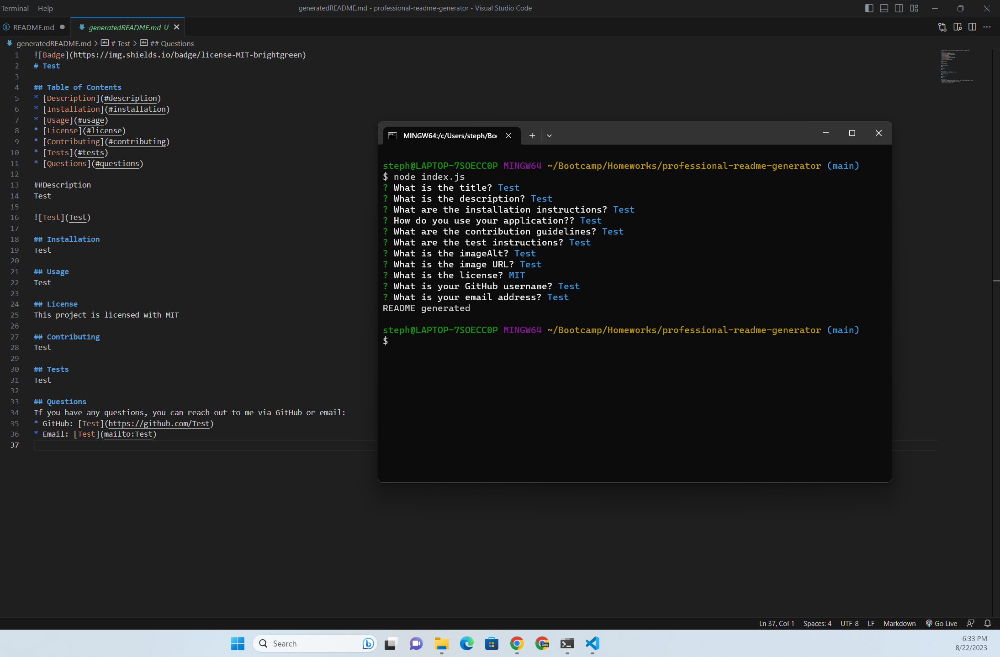

# Professional README Generator

## I built this application to be able to quickly and easily generate READMEs for future projects. It allows users to make a README by answering prompts. 

## Installation- clone the repo from my github (https://github.com/Corey-Carpenter/professional-readme-generator)

## To use navigate to wherever you cloned the repository. Once there run npm i and the node index.js. Answer the questions prompts and a README will be generated.

