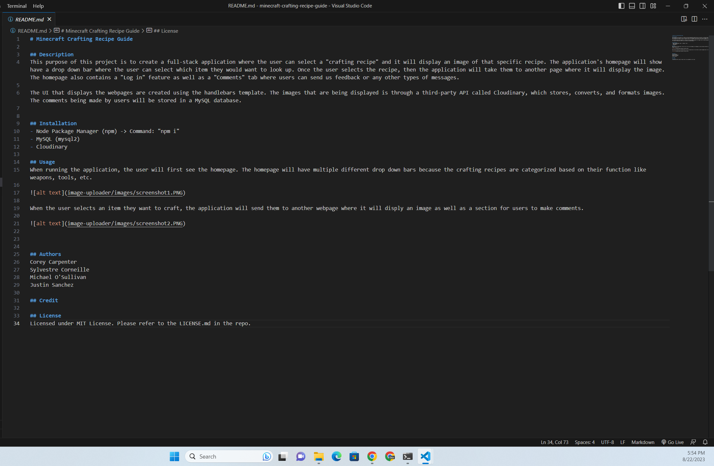

# Test Title

## Table of Contents
* [Description](#description)
* [Installation](#installation)
* [Usage](#usage)
* [License](#license)
* [Contributing](#contributing)
* [Tests](#tests)
* [Questions](#questions)

##Description
Test Description

## Installation
Test Instructions
  
## Usage
Test Usage

## License
This project is licensed with MIT

## Contributing
Test Guidelines
  
## Tests
Test Instructions
  
## Questions
If you have any questions, you can reach out to me via GitHub or email:
* GitHub: [Corey-Carpenter](https://github.com/Corey-Carpenter)
* Email: [stephcorey7@gmail.com](mailto:stephcorey7@gmail.com)
